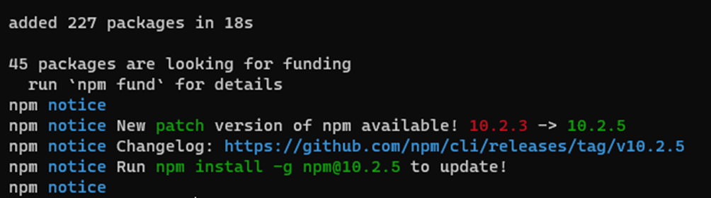
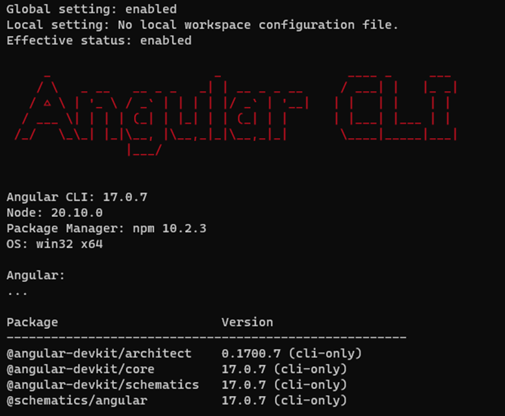
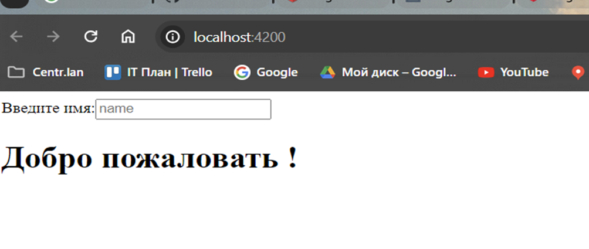

##### 
МИНИСТЕРСТВО НАУКИ И ВЫСШЕГО ОБРАЗОВАНИЯ РФ
 
##### 
Федеральное государственное бюджетное

##### 
образовательное учреждение высшего образования
 
##### 
ВЯТСКИЙ ГОСУДАРСТВЕННЫЙ УНИВЕРСИТЕТ
 
##### 
Факультет автоматики и вычислительной техники

##### 
Кафедра систем автоматизации управления

  

##### 
Лабораторной работы №1

по дисциплине 
Веб-программирование

 
 

Выполнил: Мартюшев Николай Васильевич

студент гр. ИТб-5301-02-20  курс №5

 
 
 
  

Киров 2023

 

---

**Цель лабораторной работы:** изучение основ разработки на языке Javascript/Typescript.

**Задачи лабораторной работы:** 

1. Организовать рабочее пространство и процессы разработки веб-контента.
2. Исследовать функциональные возможности инструментов разработчика на стороне браузера  
3. Исследование возможностей Javascript на стороне сервера
4. Составить отчет по выполненным задачам  
5. Защитить лабораторную работу

**
Ход выполнения
**

***1. Организовать рабочее пространство и процессы разработки веб-контента***

Разработка любой современной информационной системы начинается с организации рабочего пространства, и методов работы с ним. В рамках лабораторных работ мы будем использовать IDE Visual Studio Code (site:code.visualstudio.com; далее по тексту vscode). Среда vscode является текстовым редактором, который может быть расширен и адаптирован к языку программирования через использование плагинов.  На моем компьютере был уже установлен vscode и на рис. 1 отображена рабочая среда vscode

Рисунок 1 – Рабочая среда vscode

- VSCode All Autocomplete
- Auto Close Tag
- Auto Complete Tag
- Auto Rename Tag
- Path Intellisense
- Prettier Formatter for Visual Studio Code
- vscode-multiclip
- Live Server
- Kite Autocomplete Plugin for Visual Studio Code*
- GitLens — Git supercharged
- Font Awesome Auto-complete & Preview
- VS Code ESLint extension
- Code Runner
- Bootstrap 4, Font awesome 4, Font Awesome 5 Free & Pro snippets for Visual studio code
- Better Comments
- Visual Studio Code CSS Intellisense for HTML
- Visual Studio Code HTML Snippets
На рис. 2 показан пример установки плагина Auto Complete Tag.

Рисунок 2 – Установка плагина Auto Complete Tag 

 
  Перейдем на ресурс github.com. У меня уже был аккаунт и остается только войти под своей учетной записью. Создадим репозиторий с названием “web development” и ветку lab1. Создадим директорию “lab1” в которую будем размещать результаты лабораторных работ. Подключим директорию к репозиторию на github.com.
  

   ***2. Исследовать функциональные возможности инструментов разработчика на стороне браузера***

В рамках лабораторной работы требуется  рассмотреть любой браузер и его инструменты разработчика на основе движка рендеринга chromium. используя следующие ресурсы   

1. https://developers.google.com/web/tools/chrome-devtools
2. https://habr.com/ru/company/simbirsoft/blog/337116/
3. https://vk.cc/bXXMFm

**Панель Elements**

Используется для выбора и редактирования любых HTML элементов на странице. Позволяет свободно манипулировать DOM и CSS.
Ключевые возможности:
- Просмотр и редактирование в лайв режиме любого элемента DOM.
- Просмотр и изменение CSS правил применяемых к любому выбранному элементу в панели Styles.
- Просмотр всего списка событий и свойств для элемента на соответствующих вкладках.
  
На рис. 3 представлен фрагмент панели Elements
 

Рисунок 3 – Панель Elements

 

**Панель Console**

Необходима для логирования диагностической информации в процессе разработки или взаимодействие с JavaScript на странице.
Ключевые возможности:
- Использование консоли как отдельной панели или как окна рядом с любой другой панелью.
- Возможность группировать большое колличество сообщения или выведите их на отдельных строках.
- Очистка всех логов или сохранения их между перезагрузкой страниц, сохранение логов в отдельный файл.
- Фильтрация по типу сообщения или по регулярному выражению.
- Логирование XHR запросов.

На рис. 4 представлен фрагмент панели Console
 

Рисунок 4 – Панель Console

 

**Панель Sources**

Инструмент Sources представляет собой своего рода IDE, где мы можем посмотреть все файлы подключенные на нашей странице.
Ключевые возможности:
- Отладка Вашего кода с помощью брейкпоинтов.
- Использование браузера в качестве IDE с помощью Workspaces.
- Запуск сниппетов с любой страницы.

На рис. 5 представлен фрагмент панели Console

Рисунок 5 – Панель Sources

 

**Панель Network**

Позволяет мониторить процесс загрузки страницы и всех файлов которые подгружаются при загрузке.
Ключевые возможности:
- Возможность отключить кэширование или установление ограничения пропускной способности.
- Получение подробной таблицы с информацией о каждом запросе.
- Фильтрация и поиск по всему списку запросов.

На рис. 6 представлен фрагмент панели Network

Рисунок 6 – Панель Network

 

**Панель Performance**

Панель отображает таймлайн использования сети, выполнения JavaScript кода и загрузки памяти.
Ключевые возможности:
- Возможность сделать запись чтобы проанализировать каждое событие, которое произошло после загрузки страницы или взаимодействия с пользователем.
- Возможность просмотреть FPS, загрузку CPU и сетевые запросы в области Overview.
- Щелкните по событию в диаграмме, чтобы посмотреть детали об этом.
- Возможность изменить масштаб таймлайн, чтобы сделать анализ проще

На рис. 7 представлен фрагмент панели Performance

Рисунок 7 – Панель Performance

 

**Панель Memory и JavaScript Profiler**

Содержит несколько различных профайлеров для отслеживания нагрузки которую оказывает выполнение кода на систему:
Ключевые возможности:
- Исправление проблем с памятью.
- Профилирование CPU при работе с JavaScript.
  
На рис. 8 представлен фрагмент панели Memory

Рисунок 8 – Панель Memory

 

**Панель Application**

Вкладка для инспектирования и очистки всех загруженных ресурсов, включая IndexedDB или Web SQL базы данных, local и session storage, куков, кэша приложения, изображений, шрифтов и таблиц стилей.
Ключевые возможности:
- Быстрая очистка хранилищ и кэша.
- Инспектирование и управление хранилищами, базами данных и кэшем.
- Инспектирование и удаление файлов cookie.

На рис. 9 представлен фрагмент панели Application

Рисунок 9 – Панель Application

 

**Панель Security**

На вкладке можно ознакомится с протоколом безопасности при его наличии и просмотреть данные о сертификате безопасности, если он есть.
Ключевые возможности:
- Окно Security Overview быстро подскажет безопасна ли текущая страница или нет.
- Возможность просмотреть отдельные источники, чтобы просмотреть соединение и детали сертификата (для безопасных источников) или узнать, какие запросы не защищены (для небезопасных источников).
  
На рис. 10 представлен фрагмент панели Security

Рисунок 10 – Панель Security

 

***3. Исследование возможностей Javascript на стороне сервера***

В данном разделе требуется пройти интерактивный курс microsoft “Веб-разработка для начинающих” перейдя по ссылке https://learn.microsoft.com/ru-ru/training/paths/web-development-101/.

Пройти интерактивный курс microsoft “Создание приложений JavaScript с помощью Node.js”, перейдя по ссылке https://learn.microsoft.com/ru-ru/training/paths/build-javascript-applications-nodejs/ .

Пройти интерактивный курс microsoft “Создание приложений JavaScript с помощью TypeScript”, перейдя по ссылке https://learn.microsoft.com/ru-ru/training/paths/build-javascript-applications-typescript/.
Приступим к исследованию данных курсов.

#### Веб-разработка для начинающих

**Введение в программирование**

В первом модуле рассмотрены основные понятия программирования. Ниже приведены примеры тем.
- *Что такое программирование (процесс записи инструкций в устройство, такое как компьютер или мобильное устройство)* 
- *Какие бывают языки программирования (Языки низкого и высокого уровня)*
- *Технология браузера (браузеры для разработчиков)*

**Основные сведения о специальных возможностях веб-сайтов**

В этом модуле мы узнали больше об инструментах, которые пользователи используют для просмотра веб-страниц.
- Средства чтения с экрана (пример - экранный диктор)
- Масштабирование

Инструменты, которые разработчики используют для обеспечения доступности
- Средства проверки контрастности (для пользователей, которые страдают дальтонизмом)
- Lighthouse (средство, созданное Google для анализа веб-сайтов)

**Навыки обеспечения доступности ваших страниц**

Двумя наиболее распространенными компонентами на любой веб-странице являются ссылки и изображения. Эти элементы оказывают глубокое воздействие на доступность. Обеспечение понятного текста ссылки и замещающего текста является одним из первых шагов, которые можно предпринять, чтобы улучшить доступность страницы для всех пользователей..

**Переменные и типы данных JavaScript**

В этом модуле, мы познакомились с примитивными типами данных JavaScript, у нас есть базовые средства для начала заполнения переменных в коде. Имея эти знания, можно начать задумываться о способах использования разработчиками этих переменных для принятия решений в коде. 
Переменные могут хранить различные типы значений, например числа и текст. Эти значения называются типами данных.
Типы данных являются важной частью разработки программного обеспечения, так как разработчики используют их для принятия решений о том, как писать код и как должно работать программное обеспечение. Некоторые типы данных обладают уникальными характеристиками, которые помогают преобразовывать или извлекать дополнительные сведения в значении.
Типы данных также называются примитивами данных JavaScript, потому что они являются типами данных самого низкого уровня, которые язык позволяет использовать. Существует шесть примитивных типов данных: string, number, bigint, boolean, undefined и symbol.

*Упражнение по разделу*
Ваша компания довольна вашим ранним моделированием игры Техасский холдем и хочет, чтобы вы продолжали работать над ее реализацией. Теперь вы знаете о типах данных больше, поэтому давайте попробуем использовать эти знания.

Получился следующий результат в терминале:

**Создание модульного кода с помощью функций в JavaScript**

В этом модуле мы изучили создание функций в JavaScript. Функция — это абстракция, которая отлично подходит, когда нужно многократно выполнять одну и ту же задачу и избежать дублирования кода. Мы также узнали о различии между функцией и методом. Они являются функциями, однако функция является свободной, а метод привязан к объекту.
После этого мы рассмотрели параметры и переменные как важные элементы, позволяющие функциям работать с данными.
Далее мы узнали о возвращаемых переменных. Возвращаемое значение — это данные, покидающие функцию. Любой вызывающий объект функции может использовать возвращаемое значение, назначив его переменной.
Наконец, мы узнали об анонимных функциях. У анонимной функции нет имени, но такую функцию можно передать. Обычно она используется в контексте, где необходимо выполнить задачу, которая является асинхронной и будет завершена когда-либо в будущем. Примерами могут быть время ожидания или получение данных по сети. После завершения задачи вызывается анонимная функция.

**Принятие решений с помощью JavaScript**

На этом занятии рассматрели основные принципы принятия решений в JavaScript с помощью конструкций if/else. Узнали, как принимать решения в коде путем сравнения переменных, с помощью логических значений и конструкций if/else.

*Оператор if*
Инструкция if выполняет код между блоками, если условие истинно (true). Условие в предложении if может быть либо истинным значением, либо условным оператором, результатом которого является значение true. В коде ниже показано, как выразить предложение if.

    if (condition){
        //Condition was true. Code in this block will run.
    }

*Инструкция if...else*
Код в блок инструкции else выполнятся в случае, когда условие if принимает значение false. else является необязательной частью конструкции.

    let currentMoney = 1000;
    let laptopPrice = 1500;

    if (currentMoney >= laptopPrice) {
        //Condition was true. Code in this block will run.
        console.log("Getting a new laptop!");
    } else{
        //Condition was true. Code in this block will run.
        console.log("Can't afford a new laptop, yet!");
    }

**Массивы и циклы JavaScript**
Массив представляет собой тип структуры данных, содержащий более одного элемента. Представьте себе заказ на покупку, содержащий несколько позиций заказа, или плитку мороженого с несколькими вкусами на выбор. Вместо того, чтобы хранить, например, восемь разных вкусов мороженого как восемь разных переменных, вы можете использовать один массив для хранения этой информации, как показано ниже:

    let iceCreamFlavors = ["Chocolate", "Strawberry", "Vanilla", "Pistachio", "Neapolitan"];
Циклы позволяют выполнять повторяющиеся или итеративные задачи, и они могут сэкономить вам много времени и кода. Итерация может различаться по своим переменным, значениям и условиям. В JavaScript имеются разные типы циклов, каждый со своими небольшими отличиями. Но все они, по сути, делают одно и то же: перебирают данные.	Бывают циклы for, while, foreach.

Цикл **for** может выглядеть следующим образом:

    for (let i = 0; i < 10; i++ ) {
     console.log(i);
    }

В отличие от цикла for, для цикла **while** требуется наличие условия, которое остановит цикл только тогда, когда выражение в цикле while оценивается как false.
В следующем примере цикл while выполняется в течение 10 итераций.

    //Counting up to 10
    let i = 0;
    while (i < 10) {
      console.log(i);
      i++;
    }

Мы узнали о циклах for и while. В самом массиве есть еще один цикл, называемый forEach(). Цикл **forEach()** выполняет итерацию по элементам и предлагает упрощенный способ выполнения цикла, потому что вам не нужен счетчик, если все, что вам необходимо сделать, это цикл. Например:

    let numbers = [1, 2, 3, 4, 5];
    numbers.forEach(number => console.log(number)); // 1 2 3 4 5

**Упражнение по разделу**
Будучи владельцем магазина мороженого, вы приобрели некоторые навыки программирования и решили создать программное обеспечение для своего бизнеса. Возможно, в один прекрасный день вы превратите все это в франшизу.
Сперва вы захотите закодировать все, что вы знаете о своем магазине, например, различные вкусы и цены. Затем вы захотите смоделировать некоторые взаимодействия с клиентами. Наконец, вы захотите рассчитать свою прибыль и получить другие полезные сведения.

*Результат упражнения*

#### Создание приложений JavaScript с помощью Node.js
**Введение в Node.js**

В этом модуле мы узнали, что Node.js — это среда выполнения, с помощью которой можно запускать приложения и код JavaScript за пределами браузера. Мы также узнали о принципах работы Node.js и о том, почему Node.js является оптимальным инструментом для создания и запуска приложений JavaScript. К таким операциям можно отнести создание серверов приложений и запуск приложений в реальном времени на встроенных устройствах Интернета вещей.

**Создание нового проекта Node.js и работа с зависимостями**

Сначала мы научились устанавливать зависимости, которые наше приложение сможет использовать. Для этого достаточно просто выполнить команду *npm install* *или npm i* без аргументов, npm прочитает содержимое манифеста, найдет указанные зависимости и установит их в проект. Использование зависимостей позволяет создавать приложения быстрее, так как код уже написан. Кроме того, рекомендуется полагаться на проверенные пакеты, а не писать что-то самостоятельно. Использование этих пакетов является особенно хорошей идеей при добавлении проверки подлинности и авторизации в приложение.
Затем мы познакомились с различными способами установки зависимостей: локально, глобально и с помощью средства npm. Обычно мы устанавливаем зависимости локально.
После этого мы ознакомились с тем, как обновлять зависимости. Зависимости обновляются по разным причинам: для исправления ошибок, добавления новых функций или внесения существенных изменений. В файле package.json можно настроить необходимые типы обновлений для каждой зависимости. В корпоративной среде рекомендуется тщательно продумать выбираемый способ установки с учетом допустимых типов обновлений.
Наконец, в последнем уроке этого модуля более подробно рассматривался файл package.json. В нем были рассмотрены разные поля и было уделено особое внимание полям метаданных, описывающим приложение. Мы также ознакомились со скриптами, которые можно создавать для управления проектом Node.js в процессе разработки.

**Отладка приложений Node.js в интерактивном режиме с помощью встроенного отладчика и отладчика Visual Studio Code**

Как разработчику, вероятно, вам требуется потратить большую часть своего времени на написание новых функций. Поиск и устранение ошибок часто мешает в этом. В этом уроке мы изучили, как использование отладчиков может быть эффективной стратегией отладки проблем в программах Node.js. Мы увидели, как с помощью встроенного отладчика для быстрого исправления или отладчика Visual Studio Code для более сложных проектов можно находить и устранять эти ошибки. Мы узнали, как выполнять отладку и поиск ошибок, даже не зная код заранее.
Из этого модуля Мы узнали, как выполнять следующие задачи:
- Использование встроенного отладчика и отладчика Visual Studio Code с программой Node.js.
- Создание точек останова и пошаговое выполнение кода для поиска проблем.
- Проверка состояния программы на любом шаге выполнения.
- Анализ стека вызовов назад для поиска источника исключения.

**Работа с файлами и каталогами в приложении Node.js**

Мы завершили работу с этим модулем Learn и теперь знаете, как работать с файлами и каталогами в Node.js.
В этом модуле мы научились читать файлы и каталоги, создавать их, а также записывать данные в файлы. Наш код будет применяться в рабочей среде в вымышленной крупной интернет-компании.
Вот несколько моментов, которые следует запомнить из этого модуля:
- Всегда используйте пространство имен promises во встроенных модулях. Затем можно использовать операторы async и await для синхронного выполнения кода, избегая блокирования выполнения программы.
- Каждый раз, когда мы создаем каталог, убедитесь, что мы завернем его в try/catchкаталог. При попытке создать уже существующий каталог в Node.js по умолчанию возникает ошибка. Если требуется только проверить существование каталога, можно использовать метод stat. Этот метод не существует в promises пространстве имен, а в основном fs объекте.
- Если необходимо проанализировать другие типы файлов, проверка пакеты в npmjs.org. Например, можно использовать пакет парса для CSV-файлов. Для файлов с полями фиксированной ширины можно использовать пакет fixy.

**Создание веб-API с помощью Node.js и Express**

Мы начали с оценки базового HTTP-модуля в Node.js и увидели, как он может обрабатывать запросы. Он получает и отправляет заголовки и данные вызывающему клиенту.
Мы узнали о преимуществах использования веб-платформы, такой как Express. Мы получили некоторые знания о ее функциях и важных понятиях.
Express может выполнять различные задачи, такие как управление маршрутами и формирование различных типов ответов для отправки и скачивания файлов. Кроме того, Express может управлять жизненным циклом запроса для выполнения таких задач, как ведение журнала или проверка учетных данных.
Мы знакомы с большинством концепций в серии упражнений. мы должны чувствовать себя достаточно уверенно, создавая API RESTful с использованием Express и Node.js. В процессе обучения созданию API мы ознакомились с различными способами взаимодействия с API. Мы узнали, что для отправки запросов можно использовать браузер, код или клиент, например cURL.
На этом этапе у вас должна быть хорошая основа для создания веб-приложений с помощью Express. Мы также понимаем, что нам еще многое предстоит узнать о том, как создавать API, работать с ними, и особенно — как защищать API.

**Общие сведения об управлении маршрутами в Node.js с помощью JavaScript**

В начале этого модуля мы узнали, из чего состоит URL-адрес и какую роль в нем играют маршруты. Мы также получили представление о возможных компонентах маршрута.

мы узнали, как Express упрощает создание маршрутов API, позволяя расширить доступные для пользователей возможности. HTTP-команды наподобие GET и POST помогают еще более гибко настраивать создаваемые маршруты. Также можно использовать параметры маршрута и запроса.
На этом этапе у нас должно быть хорошее представление о том, как добавлять новые маршруты в API-интерфейсы Node.js, созданные с помощью Express с использованием JavaScript.

#### Создание приложений JavaScript с помощью TypeScript
**Начало работы с TypeScript**

TypeScript — это язык с открытым кодом, разработанный корпорацией Майкрософт. Это супермножество JavaScript, что означает, что мы можем использовать навыки JavaScript, которые мы уже разработали вместе с некоторыми функциями, которые ранее были недоступны для вас.

**Объявление типов переменных в TypeScript**

JavaScript — язык с динамической типизацией. Это упрощает объявление переменных, но в некоторых случаях может приводить к непредвиденным результатам. Статическая система типов в TypeScript позволяет описывать форму объектов, предоставлять более качественную документацию и проверять правильность работы кода. В TypeScript при объявлении пространств имен, классов, свойств, функций, переменных и других элементов языка с ними связываются типы. Способ определения типа и его сопоставления с элементом языка зависит от характера этого элемента. В этом модуле представлены некоторые из имеющихся типов и показано, как связывать их с переменными. Последующие модули будут посвящены тому, как в интерфейсах, функциях и классах используется статическая типизация.

**Реализация интерфейсов в TypeScript**

Одним из основных принципов TypeScript является тот факт, что проверка типов нацелена на форму значений. Иногда это называется неявной типизацией или структурной подтипизацией. В TypeScript интерфейсы выполняют именование этих типов и являются эффективным способом определения "контракта кода" в коде, а также контрактов с кодом за пределами проекта.

**Разработка типизированных функций с использованием TypeScript**

В JavaScript определения функций не указывают типы данных для параметров, не выполняют проверку типов для переданных аргументов и не проверяют количество полученных аргументов. Поэтому необходимо добавить логику для проверки этих параметров в функции.
TypeScript упрощает разработку функций и устранение неполадок, позволяя вводить параметры и возвращать значения. В TypeScript также предусмотрены новые возможности для параметров. Например, хотя в функциях JavaScript все параметры являются необязательными, в TypeScript можно обозначить параметры как обязательные или необязательные.
Добавление типов в функции помогает предотвратить передачу значений, которые не следует передавать в функции. Типизированные функции особенно важны при работе с более крупными базами кода или функциями, разработанными другими пользователями. Хотя добавление типов не создает существенных отличий, оно дает такое преимущество, как проверка типов передаваемых в функцию значений и возвращаемых ею данных. Вместо того чтобы добавлять в функцию всю логику для проверки правильности типа передаваемого и возвращаемого значения, с помощью TypeScript можно гарантировать правильность типов значений при разработке кода. Кроме того, при создании логики функции будет доступна полная поддержка автозаполнения, так как редактор будет знать тип данных параметров, в то время как код JavaScript, как правило, определить его не может. Автозаполнение особенно полезно при использовании функций, разработанных другими пользователями, так как TypeScript определяет необходимые типы входных и выходных данных.

**Объявление классов и создание их экземпляров в TypeScript**

Классы позволяют выражать общие объектно-ориентированные модели в стандартной форме. Благодаря этому такие функции, как наследование, становятся более удобочитаемыми и пригодными к взаимодействию. В TypeScript классы — это еще один способ определения формы объекта помимо описания типов объектов с помощью интерфейсов и функций.
Если мы еще не работали с классами, возможно, вам будет полезно ознакомиться с некоторыми основными понятиями.
Класс можно представить как проект для создания объектов, например автомобиля. Класс Car описывает атрибуты автомобиля, например цвет или количество дверей. Он также описывает возможное поведение автомобиля, например ускорение, торможение или поворот.
Но класс Car — это лишь план создания автомобиля. Чтобы класс Car стал объектом, которому можно присвоить значения свойств (например, указать, что цвет должен быть синим) или вызвать его поведение (например, использование тормоза), необходимо создать на основе этого класса экземпляр Car.
Класс Car можно использовать повторно для создания любого количества новых объектов Car, каждый из которых имеет свои собственные характеристики. Класс Car можно также расширить. Например, класс ElectricCar может расширить класс Car. Он будет иметь все те же атрибуты и поведение, что и Car, но у него также могут быть собственные уникальные атрибуты и поведение, например пробег без подзарядки и операция зарядки.

**Определение универсальных шаблонов в TypeScript**

В предыдущих модулях в схеме обучения Сборка приложений JavaScript с помощью TypeScript мы узнали, как применять аннотации типов к интерфейсам, функциям и классам для создания строго типизированных компонентов. Но что если мы хотим создать компонент, который может работать с различными типами, а не только с одним? Можно использовать тип any, но мы лишитесь преимуществ системы проверки типов TypeScript.
Универсальные шаблоны являются шаблонами кода, которые можно определять и использовать в базе кода. Они предоставляют способ указать функциям, классам или интерфейсам, какой тип мы хотите использовать при вызове. Это можно сравнить с аргументами, которые передаются в функцию, правда универсальный шаблон позволяет указать компоненту, какой тип он должен ждать в момент вызова.

**Доступ к внешним библиотекам из TypeScript**

TypeScript предоставляет два способа организации кода: пространства имен и модули. Хотя оба они предоставляют способ категоризации связанного кода в осмысленном виде и помогают контролировать, какой код предоставляется глобальному пространству имен приложений, между ними есть некоторые различия. В этом модуле содержатся сведения о модулях в TypeScript (которые в предыдущих версиях называются внешними модулями).

**Упорядочение кода с помощью пространств имен TypeScript**

Пространства имен (называемые внутренними модулями в более ранних версиях TypeScript) — это способ организации и классификации кода, относящийся к TypeScript, который позволяет группировать связанный код. Пространства имен позволяют группировать переменные, функции, интерфейсы или классы, связанные с бизнес-правилами, в одном пространстве имен, а безопасность — в другом.
Код внутри пространства имен извлекается из глобальной области в область пространства имен. Такое размещение помогает избежать конфликтов именования между компонентами в глобальном пространстве имен. Это может быть полезно при работе с распределенными группами разработки, которые могут использовать аналогичные имена компонентов.
Например, namespace A и namespace B совместно используют функцию с именем functionName. Любая попытка доступа к функции без ссылки на ее пространство имен приводит к ошибке, так как объявления переменных находятся в глобальном пространстве имен, а две функции содержатся в области их соответствующих пространств имен.
