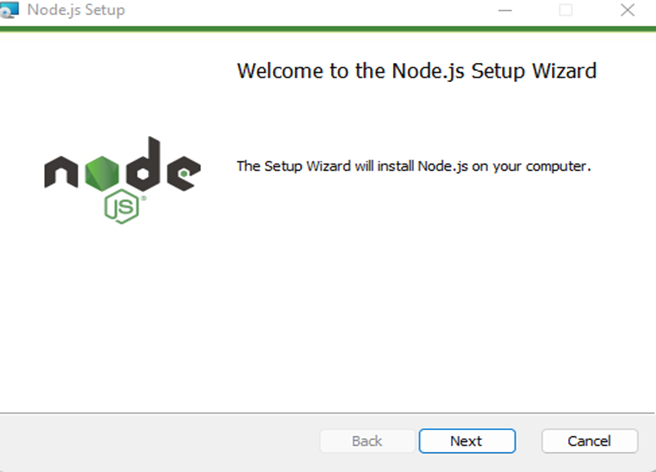
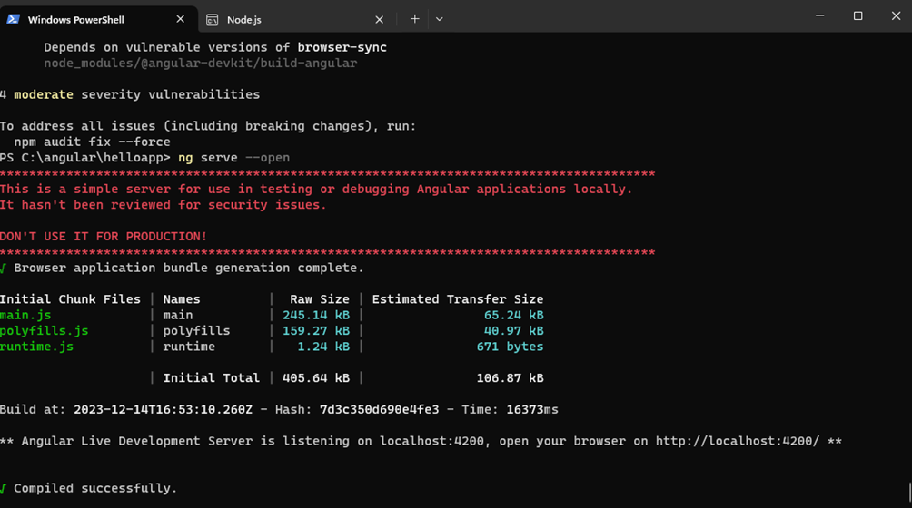
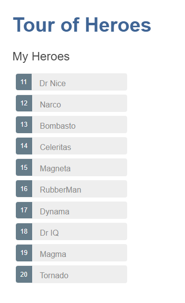

##### 
МИНИСТЕРСТВО НАУКИ И ВЫСШЕГО ОБРАЗОВАНИЯ РФ
 
##### 
Федеральное государственное бюджетное

##### 
образовательное учреждение высшего образования
 
##### 
ВЯТСКИЙ ГОСУДАРСТВЕННЫЙ УНИВЕРСИТЕТ
 
##### 
Факультет автоматики и вычислительной техники

##### 
Кафедра систем автоматизации управления

  

##### 
Лабораторной работы №1

по дисциплине 
Веб-программирование

 
 

Выполнил: Мартюшев Николай Васильевич

студент гр. ИТб-5301-02-20  курс №5

 
 
 
  

Киров 2023

 

---
**Цель лабораторной работы:** изучение основ разработки клиентских приложений c использованием библиотеки Angular.

**Задачи лабораторной работы:**

1. Изучить теоретический материал
2. Реализовать обучающее приложение
3. Разработать приложение по варианту
4. Составить отчет по выполненным задачам
5. Защитить лабораторную работу

**Ход выполнения**

***1. Изучить теоретический материал***

Для работы с Angular необходимо установить сервер Node.js и пакетный менеджер npm. Для установки можно использовать программу установки node.js. Вместе с сервером она также установит и npm.  

 

Для компиляции приложения мы будем использовать инфрастуктуру Angular CLI. Angular CLI упрощает создание приложения, его компиляцию. Angular CLI распространяется как пакет npm, поэтому для его использования его необходимо сначала установить. Для установки Angular CLI откроем консоль/командную строку и выполним в ней следующую команду:

     npm install -g @angular/cli
Результат установки

 
Проверить версию CLI можно в командной строке/консоли с помощью команды:

    ng version

 
При работе на Windows и выполнении команд в PowerShell вместо командной строки стоит учитывать, что по умолчанию выполнение скриптов в PowerShell отключено. Чтобы разрешить выполнение скриптов PowerShell (что требуется для npm), необходимо выполнить следующую команду:

    Set-ExecutionPolicy -Scope CurrentUser -ExecutionPolicy RemoteSigned
 
Если мы используем TypeScript для работы с Angular и Angular CLI для компиляции, то эти файлы package.json, tsconfig.json и angular.json фактически будут присутствовать в каждом проекте. И их можно переносить из проекта в проект с минимальными изменениями. Например, в файле angular.json вместо названия проекта "helloapp" будет соответствующее название проекта. В файле package.json можно будет задать какие-то другие версии пакетов, если предыдущие версии устарели. Можно будет изменить название проекта, версию. Можно подправить настройки TypeScript или Angular CLI, но в целом общая организация будет той же. В итоге у нас получится следующая структура проекта.

 
И теперь, когда все готово, мы можем запустить проект. Для этого в командной строке (терминале) перейдем к папке проекта с помощью команды cd и затем выполним команду:

    ng serve
 

Консольный вывод проинформирует нас, какие файлы какого размера созданы. Кроме того, мы сможем увидеть адрес, по которому запущен тестовый веб-сервер - по умолчанию это "http://localhost:4200/". Если мы передаем команде флаг --open, как в случае выше, то Angular CLI автоматически открывае браузер с запущенным приложением. И мы можем обратиться к приложению.

 

***2. Реализовать обучающее приложение***

Приложение "Путь героев"

Создание нового рабочего пространства и базового приложения

Руководство Путь героев описывает основные принципы работы с фреймворком Angular. Вы узнаете, как установить собственную локальную среду разработки и создать приложение с применением инструментов CLI Angular.

С помощью команды:

    ng new angular-tour-of-heroes.
Ниже представлено дерево файлов после выполнения команды

После ряда измении в конфигурационных файлов src/app/app.component.ts, src/app/app.component.html, src/styles.css (excerpt) открывается новая страница с названием “Путь героев”. Для запуска программы выполним команду в терменале в папке проекта:

    ng serve --open

 
**Создание компонента с информацией о героях**

С помощью Angular CLI создайте новый компонент heroes и введем команду:

    ng generate component heroes.

CLI создает новую папку src/app/heroes/ и четыре файла HeroesComponent

Добавление свойства hero

heroes.component.ts (hero property)

    hero = 'Windstorm';

Для отображения HeroesComponent следует добавить вид к шаблону оболочки AppComponent

src/app/app.component.html

    <h1>{{title}}</h1>
    <app-heroes></app-heroes>

Создайте класс Hero в отдельном файле в папке src/app. Добавьте свойства id и name 

src/app/hero.ts

    export class Hero {
    id: number;
    name: string;
    }

Обновите привязку в шаблоне по имени героя и отобразите id и name в подробном макете странице 

heroes.component.html (HeroesComponent's template)

    <h2>{{hero.name}} Details</h2>
    
id: {{hero.id}}

    
name: {{hero.name}}

Измените привязку hero.name вот так.

    <h2>{{hero.name | uppercase}} Details</h2>

Отредактируйте область детальной информации в шаблоне HeroesComponent:

 src/app/heroes/heroes.component.html (HeroesComponent's template)

    

    <label>name:
        <input [(ngModel)]="hero.name" placeholder="name"/>
    </label>
    

Откройте AppModule (app.module.ts) и импортируйте символ FormsModule из библиотеки @angular/forms 

app.module.ts (FormsModule symbol import)

    import { FormsModule } from '@angular/forms'; // <-- NgModel lives here

Затем добавьте FormsModule к группе imports метаданных @NgModule, которая содержит список внешних модулей для приложения.

app.module.ts ( @NgModule imports)

    content_copy
    imports: [
    BrowserModule,
    FormsModule
    ],

Откройте src/app/app.module.ts и найдите HeroesComponent, импортированный вверху.

    import { HeroesComponent } from './heroes/heroes.component';

Окончательный просмотр

**Отображение списка героев**

Создайте файл mock-heroes.ts в папке src/app/. Задайте константу HEROES как массив из десяти героев и экспортируйте эту константу. Файл должен выглядеть так:

src/app/mock-heroes.ts

    import { Hero } from './hero';

    export const HEROES: Hero[] = [
    { id: 11, name: 'Dr Nice' },
    { id: 12, name: 'Narco' },
    { id: 13, name: 'Bombasto' },
    { id: 14, name: 'Celeritas' },
    { id: 15, name: 'Magneta' },
    { id: 16, name: 'RubberMan' },
    { id: 17, name: 'Dynama' },
    { id: 18, name: 'Dr IQ' },
    { id: 19, name: 'Magma' },
    { id: 20, name: 'Tornado' }
    ];

Откройте файл класса HeroesComponent и импортируйте тестовую константу HEROES.

src/app/heroes/heroes.component.ts (import HEROES)

    import { HEROES } from '../mock-heroes';

В этом же файле (класс HeroesComponent) задайте свойство компонента heroes для привязки массива HEROES.

    export class HeroesComponent implements OnInit {

    heroes = HEROES;

Когда CLI генерирует HeroesComponent, создается пустая таблица стилей heroes.component.css для HeroesComponent, и указывается в @Component.styleUrls так.

src/app/heroes/heroes.component.ts (@Component)

    @Component({
    selector: 'app-heroes',
    templateUrl: './heroes.component.html',
    styleUrls: ['./heroes.component.css']
    })

Добавьте следующий метод onSelect(), который назначает selectedHero компоненту выделенного кликом мышки героя из шаблона.

src/app/heroes/heroes.component.ts (onSelect)

    selectedHero: Hero;
    onSelect(hero: Hero): void {
    this.selectedHero = hero;
    }

Шаблон все еще связан со старым свойством hero компонента, которое больше не существует. Переименуйте hero на selectedHero.

heroes.component.html (selected hero details)

    <h2>{{selectedHero.name | uppercase}} Details</h2>
    
id: {{selectedHero.id}}

    

    <label>name:
        <input [(ngModel)]="selectedHero.name" placeholder="name"/>
    </label>
    

Окончательный просмотр

**Компоненты основного/подробного списка**

Используйте Angular CLI для создания нового компонента hero-detail.

    ng generate component hero-detail

Откройте файл класса HeroDetailComponent и импортируйте символ Hero.

src/app/hero-detail/hero-detail.component.ts (import Hero)

    import { Hero } from '../hero';

Свойство hero должно быть входным свойством, аннотированным декоратором @Input() , т.к. внешний HeroesComponent привязан к нему вот так:

    <app-hero-detail [hero]="selectedHero"></app-hero-detail>

Измените оператора импорта @angular/core для включения символа Input.

src/app/hero-detail/hero-detail.component.ts (import Input)

    import { Component, OnInit, Input } from '@angular/core';

Добавьте свойство hero, перед которым следует декоратор @Input().

    @Input() hero: Hero;

Привяжите HeroesComponent.selectedHero к свойству hero элемента вот так:

    <app-hero-detail [hero]="selectedHero"></app-hero-detail>

Что поменялось?
Как и раньше, при клике на имя героя ниже списка героев появляется информация о данном герое. Сейчас информацию представляет класс HeroDetailComponent, а не HeroesComponent.

И сейчас, и в будущем переписывание оригинального класса HeroesComponent на два компонента даст определенные преимущества:
1. Мы упростили HeroesComponent за счет уменьшения количества выполняемых задач.

2. Из HeroDetailComponent можно сделать многофункционального редактора героев без привязки к родительскому элементу HeroesComponent.

3. Можно усовершенствовать HeroesComponent без изменения вида информации о героях.

4. Можно повторно использовать HeroDetailComponent в шаблоне будущего компонента.

Окончательный просмотр

**Сервисы**

Сервисы - прекрасный способ поделиться информацией между классами, которые не знают друг друга. Мы создадим MessageService и встроем его в двух местах:

1. в HeroService, который обращается к сервису для отправки сообщений.
2. в MessagesComponent, который отображает эти сообщения.

При помощи Angular CLI создадим сервис hero.

    ng generate service hero

Импортируйте Hero и HEROES.

    import { Hero } from './hero';
    import { HEROES } from './mock-heroes';

Добавьте метод getHeroes для возврата фейковых героев.

    getHeroes(): Hero[] {
    return HEROES;
    }

Удалите импортированный элемент HEROES, т.к. Вам он больше не нужен. Вместо него импортируйте HeroService.

src/app/heroes/heroes.component.ts (import HeroService)

    import { HeroService } from '../hero.service';

Замените определение свойства heroes простым объявлением.

    heroes: Hero[];

Добавьте приватный параметр heroService типа HeroService в конструктор.

    constructor(private heroService: HeroService) { }

Используйте CLI для создания MessageService в src/app.

    ng generate service message

Повторно откройте HeroService и импортируйте MessageService.

    import { MessageService } from './message.service';

Измените в конструкторе параметр, который описывает приватное свойство messageService. Фреймворк Angular включает одиночный экземпляр MessageService в свойство при создании HeroService.

    constructor(private messageService: MessageService) { }

Окончательный просмотр кода

**Маршрутизация**

Eсть новые требования к приложению "Путь героев":

- Добавить вид Dashboard.
- Добавить возможность навигации между видами Heroes и Dashboard.
- При нажатии на имя героя в любом варианте отображения информации переходить на подробную информацию о выбранном герое.
- При нажатии на deep link в электронной почте открыть подробную информацию об определенном герое.

Для его создания воспользуйтесь CLI.

    ng generate module app-routing --flat --module=app

Добавление маршрутов

Routes говорит маршрутизатору какой вид отображать при нажатии на ссылку или копировании URL в адресную строку браузера.

В стандартном Route фреймворка Angular два свойства:

1. path: строка, совпадающая с URL в адресной строке браузера.
2. component: компонент, который создает маршрутизатор при навигации по этому маршруту.
Нужно перейти к HeroesComponent, когда URL выглядит примерно так: localhost:4200/heroes.

Импортируйте HeroesComponent, чтобы ссылться на него в Route. Затем определите массив маршрутов с единственным route к этому компоненту.

import { HeroesComponent }      from './heroes/heroes.component';

    const routes: Routes = [
    { path: 'heroes', component: HeroesComponent }
    ];

Тестирование проходит с выполнением этой команды CLI.

    ng serve

Добавление вида центральной панели

    ng generate component dashboard

Добавление маршрута к dashboard. 
Импортируйте DashboardComponent в AppRoutingModule.

src/app/app-routing.module.ts (import DashboardComponent)

    import { DashboardComponent }   from './dashboard/dashboard.component';

Добавьте маршрут к массиву AppRoutingModule.routes, который соответствует пути к DashboardComponent.

    { path: 'dashboard', component: DashboardComponent },

Окончательный вариант

**HTTP**

Здесь мы добавим возможность сохранения данных с помощью HttpClient фреймворка Angular.

HeroService получает данные о героях с помощью HTTP-запросов.
Пользователи могут добавлять, редактировать и удалять героев, сохранять эти изменения через HTTP.
Пользователи могут искать героев по имени.

HttpClient - механизм фреймворка Angular для взаимодействия с удаленным сервером через HTTP.

src/app/app.module.ts (Http Client import)

    import { HttpClientModule }    from '@angular/common/http';

После установки модуля приложение отсылает запросы и получает ответы от HttpClient, при этом приложение не знает, что In-memory Web API перехватывает эти запросы, применяет их к массивам данных в оперативной памяти и возвращает смоделированные ответы.

Установите пакет In-memory Web API из npm

    npm install angular-in-memory-web-api --save

Класс src/app/in-memory-data.service.ts генерируется следующей командой:

    ng generate service InMemoryData

Импортируйте HttpClientInMemoryWebApiModule и класс InMemoryDataService.

src/app/app.module.ts (In-memory Web API imports)

    import { HttpClientInMemoryWebApiModule } from 'angular-in-memory-web-api';
    import { InMemoryDataService }  from './in-memory-data.service';

Создание HeroSearchComponent

    ng generate component hero-search

Тестирование
Снова запустите приложение. На центральной панели введите какой-нибудь текст в строке поиска. Если вводимые символы соответствуют существующим именам героев, то получится следующее:

Окончательный вариант

